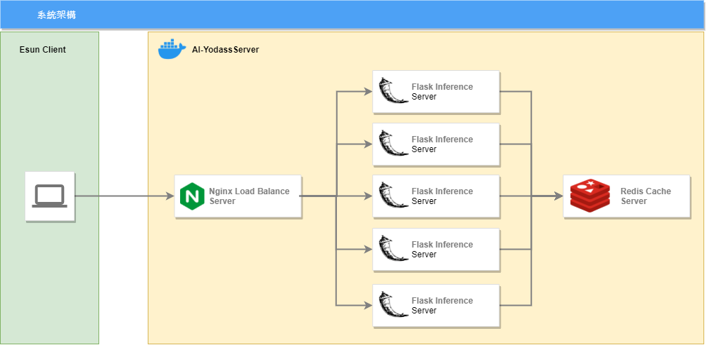
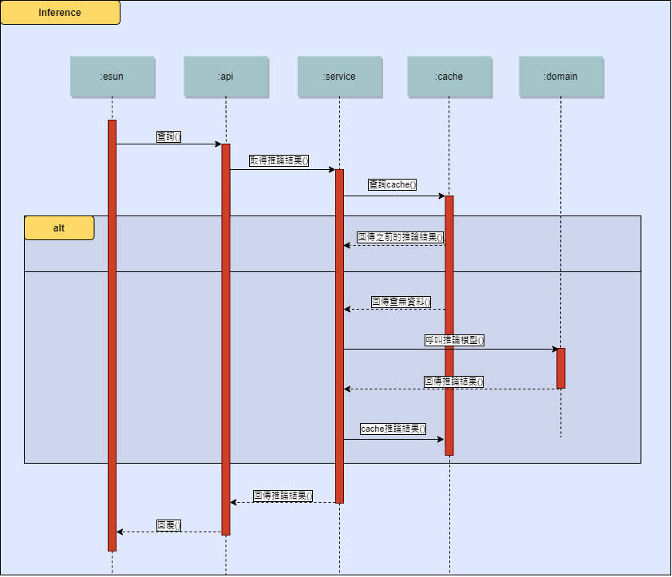

# 本文說明，本專案係參加玉山-2021 ＡI人工智慧手寫中文字辨識公開挑戰賽「API最佳服務獎」之說明文件，我們是參賽隊伍「AI-Yodass』。我們是一支產學合作的隊伍。

* [設計緣起](#設計緣起)
* [發現問題](#發現問題)
* [系統目標](#系統目標)
* [API服務架構](#API服務架構)
* [實測結果](#實測結果)
* [參賽結果](#參賽結果)
* [硬體資源](#硬體資源)
* [架構圖](#架構圖)
* [循序圖](#循序圖)
* [打包方式](#打包方式)
* [啟動方式](#啟動方式)
* [測試程式](#測試程式)

# 設計緣起

玉山-2021ＡI人工智慧手寫中文字辨識公開挑戰賽參賽期間，我們一直不斷地優化AI模型的精準度，導致模型愈來愈大，推論的時間也拉長，五月的測試賽原本本團隊都保持在第七名的成績，但在6月8日的加場測試賽時，我們團隊的成績竟然因為模型過大，導致推論時間過長，比賽成績還因此跌出前十名以外，因此我們開始研究如何提高api系統服務的效能與吞吐量？

# 發現問題

五月連續三天的測試賽，本團隊使用單一模型上線參賽，當時前三天成績一直穩定保持在第七名。
到了6/8的加場測試賽前一天，本團隊開始使用重新訓練的 ensemble 模型，本團隊測試流程先將這個模型放在 GCP 上運行，經測試後回應時間介於0.65~0.85秒之間，因此認為這個模型應該沒有太大問題。

但是在6/8測試賽時因為有少部份的request回應時間會大於1秒，玉山主辦單位會重送這些 request ，造成 request 量變多，回應時間變慢，所以愈來愈多 timeout 案例發生，最後在6/8日該場加測賽結束後，統計結果我們收到2000多筆逾時結果。
因此如何在提高模型精準度之後，亦能顧及api 服務效能，以提高服務吞吐量及響應成功率？成為我們進入正式決賽前要嚴肅面對與解決的關鍵問題。

# 系統目標

因此我們以以下四個重點目標進行系統設計：  
1. 吞吐量彈性：比賽要求需能同時處理3~10個 request，並在一秒內 response 。因此系統需可以以設定參數的方式，在開發環境與正式環境調整 request 的處理效率。  
2. 回應成功率：因為即使 request timeout ， server 端已完成推論，因此在下次 request 時， server 應直接 response 已計算完的結果不需重算，以確保回應成功率。  
3. 佈署便利性：團隊成員的開發環境在 linux 及 windows 都有，而且比賽伺服器預定是筆電但需有雲端伺服器當備案，所以系統架構必須同時可以在這些環境開發及佈署；此外每日比賽完後需重新 fine tune 模型及更版，所以也必需能方便且快速地重新佈署模型。  
4. 經濟性：因為 GPU 要價不斐，所以僅在模型訓練期間使用 Colab GPU ，在比賽期間使用 CPU 進行推論； Cluster 的解決方案(ex. k8s)因為需開多台機器花費較大，所以採用單一台機器做為解決方案。  

# API服務架構

經過團隊的努力下，不斷地進行壓測與單元測試，我們設計採用 Docker 容器技術並以 Docker-Compose 進行容器編排以構建多層次架構服務組態，由 Nginx 容器負責 Round Robin Load Balance 給5台 Flask 推論服務器，而這5台推論服務器將推論的結果 Cache 到 Redis 服務器，如果收到同樣的 Request ，任意一台推論服務器都可以將之前計算的結果 Response 給用戶端。

# 實測結果

1. 可在服務啟動時下指令決定啟動 Flask 推論服務器的數量，以調整 request 處理效率。(ex. 本機開發階段只啟動1台 Flask 推論服務器以節省資源耗用；正式環境啟動5台 Flask 推論服務器以提升 request 處理效率)
2. 壓測1萬筆 request ，且每秒同時發送5個 requests的情況下，response 都能維持在0.85秒左右回應。
3. 在本機開發與正式環境佈署都使用同一套指令與流程進行測試及佈署；且每日 fine tune 完模型後，可在10分鐘內重新打包成 docker image 及佈署上線。
4. 即使是使用 ensemble 5 個 EfficientNetB0 的大模型，只使用 CPU 及單機伺服器，也可以符合比賽的要求。

# 參賽結果

在6/15-6/18的正式賽，我們正式使用了 Load Balance (Nginx)+5台的 Container App 架構上線參賽。 然後我們正式賽四天各單日成績取得了第一天(6/15)第3名、第二天(6/16)第4名、第三天(6/17)第5名、第四天(6/18)第1名的優異成績，最後經大會結算榮獲亞軍的榮譽。

# 硬體資源

我們使用以下規格的筆電架設我們的服務：  
* 作業系統: Ubuntu 20.04
* CPU: 6 core / 12 thread
* RAM: 32 GB
* HD: PCI-SSD

# 架構圖

1. Nginx Load Balance Server: 接收 request，並以 Round Robin 方式 Load Balance 給5台 Flask Inference Server。
2. Flask Inference Server: 收到 Nginx Load Balance Server 轉發的 request 後，先以 esun_uuid 查詢 Redis Cache Server 是否已有資料，如果有則讀取 Cache 中的資料回傳，沒有才呼叫模型進行推論。
3. Redis Cache Server: 以 esun_uuit 為 key 值存放 Flask Inference Server 的推論結果。

# 循序圖

1. esun 客戶端發送 request。
2. api 記錄 log 後向 service 查詢推論結果。
3. service 先查詢 cache 中是否有之前算過的答案，如果有則直接回傳；如果沒有則呼叫 domain 。
4. domain 將 request 中的 base64 字串轉換成圖檔，並 resize 成模型輸入的大小 (224×224×3)後，輸入模型取得預測的文字，如果在玉山800字的字集中則直接回傳答案，否則回傳 isnull。
5. sevice 取得預測的文字，並將推論結果儲存至 cache 後將結果回傳。

# 打包方式
1. 下載本專案：  

       git clone https://github.com/hsiehpinghan/esun_ai_2021_summer_tradevan.git
2. 安裝 docker，安裝方式請參考 https://docs.docker.com/engine/install/ ， 下面是 ubuntu 的安裝方式：

       sudo apt-get update
       sudo apt-get install apt-transport-https ca-certificates curl gnupg lsb-release
       curl -fsSL https://download.docker.com/linux/ubuntu/gpg | sudo gpg --dearmor -o /usr/share/keyrings/docker-archive-keyring.gpg
       echo "deb [arch=amd64 signed-by=/usr/share/keyrings/docker-archive-keyring.gpg] https://download.docker.com/linux/ubuntu $(lsb_release -cs) stable" | sudo tee /etc/apt/sources.list.d/docker.list > /dev/null
       sudo apt-get update
       sudo apt-get install docker-ce docker-ce-cli containerd.io
## Nginx Load Balance Server Image 打包方式
1. 打包 docker image

       cd esun_ai_2021_summer_tradevan/nginx
       sudo docker build -t hsiehpinghan/load_balance:1.0.0 .
2. 將 docker image 推送到 register

       sudo docker login
       sudo docker push hsiehpinghan/load_balance:1.0.0
## Flask Inference Server Image 打包方式
1. 將 https://drive.google.com/drive/folders/1Fa_qgc-xE3_sbrMy04bLzANyvUor4kk-?usp=sharing 中的模型放到 esun_ai_2021_summer_tradevan/model 資料夾。
2. 打包 docker image

       cd esun_ai_2021_summer_tradevan
       sudo docker build -t hsiehpinghan/esun_ai_2021_summer_tradevan:6.0.0 .
3. 將 docker image 推送到 register

       docker push hsiehpinghan/esun_ai_2021_summer_tradevan:6.0.0
# 啟動方式
1. 安裝 docker：請參考[打包方式](#打包方式)安裝 docker。
2. 安裝 docker-compose

       sudo curl -L "https://github.com/docker/compose/releases/download/1.29.2/docker-compose-$(uname -s)-$(uname -m)" -o /usr/local/bin/docker-compose
       sudo chmod +x /usr/local/bin/docker-compose
## 開發環境
1. 執行以下指令: (只啟動1台 Flask 推論服務器節省資源)

       cd esun_ai_2021_summer_tradevan
       sudo docker-compose up -d --scale esun_ai_2021_summer_tradevan=1
2. 等待載入模型及 Flask 推論服務器啟動完成：執行以下指令，當看到 INFO:werkzeug: * Running on http://172.18.0.3:5000/ (Press CTRL+C to quit) 代表成功啟動了，可以輸入 CTRL+C 跳出。

       tail -f /tmp/esun_ai_2021_summer_tradevan.log
3. 測試 api：輸入以下指令，如果回傳 {"answer":"\u5fb7","esun_uuid":"6465e4f10a0b099c44791e901efb7e8d9268b972b95b6fa53db93780b6b22fbf","server_timestamp"
:1625420756,"server_uuid":"83dee6fb2dacf8f3416da825e1b1c1d8bc829c2038b7bf1e4ee2247f75e11e34"} 的資料格式，代表成功了!

       curl -v -X POST -H "Content-Type: application/json" -d '{"esun_uuid": "6465e4f10a0b099c44791e901efb7e8d9268b972b95b6fa53db93780b6b22fbf","esun_timestamp": 1590493849,"image": "/9j/4AAQSkZJRgABAQAAAQABAAD/2wBDAAgGBgcGBQgHBwcJCQgKDBQNDAsLDBkSEw8UHRofHh0aHBwgJC4nICIsIxwcKDcpLDAxNDQ0Hyc5PTgyPC4zNDL/2wBDAQkJCQwLDBgNDRgyIRwhMjIyMjIyMjIyMjIyMjIyMjIyMjIyMjIyMjIyMjIyMjIyMjIyMjIyMjIyMjIyMjIyMjL/wAARCABDAEEDASIAAhEBAxEB/8QAHwAAAQUBAQEBAQEAAAAAAAAAAAECAwQFBgcICQoL/8QAtRAAAgEDAwIEAwUFBAQAAAF9AQIDAAQRBRIhMUEGE1FhByJxFDKBkaEII0KxwRVS0fAkM2JyggkKFhcYGRolJicoKSo0NTY3ODk6Q0RFRkdISUpTVFVWV1hZWmNkZWZnaGlqc3R1dnd4eXqDhIWGh4iJipKTlJWWl5iZmqKjpKWmp6ipqrKztLW2t7i5usLDxMXGx8jJytLT1NXW19jZ2uHi4+Tl5ufo6erx8vP09fb3+Pn6/8QAHwEAAwEBAQEBAQEBAQAAAAAAAAECAwQFBgcICQoL/8QAtREAAgECBAQDBAcFBAQAAQJ3AAECAxEEBSExBhJBUQdhcRMiMoEIFEKRobHBCSMzUvAVYnLRChYkNOEl8RcYGRomJygpKjU2Nzg5OkNERUZHSElKU1RVVldYWVpjZGVmZ2hpanN0dXZ3eHl6goOEhYaHiImKkpOUlZaXmJmaoqOkpaanqKmqsrO0tba3uLm6wsPExcbHyMnK0tPU1dbX2Nna4uPk5ebn6Onq8vP09fb3+Pn6/9oADAMBAAIRAxEAPwC5J401/wCxu/8AYe393Cf9TN60yfxnr93bSRjRsiWZoyfJm4GD/hXpA8nLfSkRIWT8a4OWXc91YrD30pL72eZaP4o13T9It7dNH81Fhl+byZuD6VKnjHxDLbqq6HtxHCc+TN616JcRRpbuUB7ZO7aKope2M15PAk8DzKAzIsm5x25HpS5JW3E8XQf/AC6X3s4b/hM/EX2qNW0TdiaT/ljNSXHjPXwiL/Ye3epXPkzf3ga76Ty8Ls65pB/rvwpqMujB4qhdXpL72eean4j17UbV4P7H/wCWkS/6mb6/0q0vjHxCIsJo/O2Vf9TN2xXdu6Rr83c0/ZDsDetTya3bGsZRas6S+9nmH/CY+Jf+gP8A+QZqK9O/cUVXI+4/rND/AJ9L72XgsrxsD12cfnVW51m00+W2trxts8x8uL3bBx/I1Q13xJpmiwYuXyXGTH61xmkWeveK/Etrrep2qWtrbyYtN/8AEuK6YUrrmlojy5T5TsNeutZt9ORtH02K/nXKtHJ0YZrzGzfxZrviG8uLbT7G3n4hldmx5XsPyr1NtYsrS7S1nZ7eZySR/CoHU/nXl2m+Iv7O8TahNp0Uupm6nOFjfaVx6n0H9a6KClbliu+/qZyte708jpNF8E3ljdLe6prNzLceYDsWXcg47CutO95ZXyhUDAb+I81w0vj7VpoJp4NBMFvBMBNI11sIJ4rtYGSYCWI7k2hieuCR03d6wqRe8lr5GkHG2hPvlXy/K+9t5qZ5m8sbvvZqpcL50LPvdcf3P61We+tlVIvMDsE52/f/AB9qxaLS5tjS86isj7Sv/Teilp2J5H3Oqe1ikVfNjRyuCofsfX8s15mdX1HVfiX9m0y/jXS4ZgFjTsAp3frit3xadY1Bv7K0hJ4A2PPmeLag7cH1rFvPDel+GPE/h6O0j23bsfPf/nodjHNdcKajGz+J7Iy5uZ6E3i6CBdbsEmINtdQyM7HoSOOfasC78QaLourZtjGix2SojWy5RXPTPv1r0bX/AA/H4h0KWzllMcZSMlgM9M/l1rlTp3gDwtdxme7tTe2yqQfOeRgcY+4vT61dOonCz+6xTfVfecJaW+p63BpWm2lvJHbrK1xI7x7fMPTOf+BV7RaWrQwxE/8ALNPLP161laZ4o0fV5/I0m5lnCt5bsscigZ93+lbL2iSpNFKZhE48t/cH/wDVWVaV2k9BQTUWwmbYo9zWZJDG9yzw/wCsCkn6ZrjdU8P+M9E1JpND1Ca+sQSypuRdq91+b3xWz4d1LXL+5ZdQ0mSzQRn940kbbmyMcL+P5VEqdldO44TadjY856Ku+XN6UVnc25o9zfYoLfKPsGAD9a8/1sPc/FbT4ELSNaODhe2VPJruNJ0uLTLKGGE/uUXKH+9kc/0rl7eH7V8U9Qb+7FEf0rWkrc8l0MHNJp+bJvFGla1qkds2lahBZWnzefI+/cmDzjb3rmPCXhbTr+7urya2gu9Pd/3NxcJIzyAcEgP2zXY+MLmW28KXUsRwzRuh/EGodEsJV8EWdmm5Z2s0CFf4Syk/0q4t+wVtNSZTV7oZe2T2mlSJ4RttP81ZP9U42ZGD3+uOKz/D2p6nczyWmtQRWl8ilxbxvuGMgZx7ZxWboXi6Xw9Yx2Gv6fe2jpK3+kOrskg9tvesbX9Z0m58U2l7o2qSXcryBHgeORdq8ktl/cAfjVKEmmt/MObZnqEn+qH1qEJvIpkO6eFXaPYxxVvy9iA1x6p2saIZ5FFLRVXHyI23RTG5KjO70964ayVYfHmsXCqplZgCzDd296KKuHwMJ7o2Z9l7aSR3MFvKgjJAaFODuHtUpvJln2L5YVIwFHlLx+lFFRP4V6sS3Ksbi+lkhuobeaPafleBCOv0rItNJ0y21GSWDTLKORELKy26ZB49qKKr7JP2i/ZXk08s3mFDg4GI1H8hW1YxJPIRIMjb2OO/tRRULYtLQu/2da/3G/7+N/jRRRSLP//Z","retry": 2}' http://localhost/inference
4. 關閉服務

       sudo docker-compose down
## 正式環境
1. 執行以下指令: (同時啟動5台 Flask 推論服務器提升 request 處理效率)

       cd esun_ai_2021_summer_tradevan
       sudo docker-compose up -d --scale esun_ai_2021_summer_tradevan=5
2. 等待載入模型及 Flask 推論服務器啟動完成：執行以下指令，當看到 INFO:werkzeug: * Running on http://172.18.0.3:5000/ (Press CTRL+C to quit) 代表成功啟動了，可以輸入 CTRL+C 跳出。

       tail -f /tmp/esun_ai_2021_summer_tradevan.log
3. 測試 api：輸入以下指令，如果回傳 {"answer":"\u5fb7","esun_uuid":"6465e4f10a0b099c44791e901efb7e8d9268b972b95b6fa53db93780b6b22fbf","server_timestamp"
:1625420756,"server_uuid":"83dee6fb2dacf8f3416da825e1b1c1d8bc829c2038b7bf1e4ee2247f75e11e34"} 的資料格式，代表成功了!

       curl -v -X POST -H "Content-Type: application/json" -d '{"esun_uuid": "6465e4f10a0b099c44791e901efb7e8d9268b972b95b6fa53db93780b6b22fbf","esun_timestamp": 1590493849,"image": "/9j/4AAQSkZJRgABAQAAAQABAAD/2wBDAAgGBgcGBQgHBwcJCQgKDBQNDAsLDBkSEw8UHRofHh0aHBwgJC4nICIsIxwcKDcpLDAxNDQ0Hyc5PTgyPC4zNDL/2wBDAQkJCQwLDBgNDRgyIRwhMjIyMjIyMjIyMjIyMjIyMjIyMjIyMjIyMjIyMjIyMjIyMjIyMjIyMjIyMjIyMjIyMjL/wAARCABDAEEDASIAAhEBAxEB/8QAHwAAAQUBAQEBAQEAAAAAAAAAAAECAwQFBgcICQoL/8QAtRAAAgEDAwIEAwUFBAQAAAF9AQIDAAQRBRIhMUEGE1FhByJxFDKBkaEII0KxwRVS0fAkM2JyggkKFhcYGRolJicoKSo0NTY3ODk6Q0RFRkdISUpTVFVWV1hZWmNkZWZnaGlqc3R1dnd4eXqDhIWGh4iJipKTlJWWl5iZmqKjpKWmp6ipqrKztLW2t7i5usLDxMXGx8jJytLT1NXW19jZ2uHi4+Tl5ufo6erx8vP09fb3+Pn6/8QAHwEAAwEBAQEBAQEBAQAAAAAAAAECAwQFBgcICQoL/8QAtREAAgECBAQDBAcFBAQAAQJ3AAECAxEEBSExBhJBUQdhcRMiMoEIFEKRobHBCSMzUvAVYnLRChYkNOEl8RcYGRomJygpKjU2Nzg5OkNERUZHSElKU1RVVldYWVpjZGVmZ2hpanN0dXZ3eHl6goOEhYaHiImKkpOUlZaXmJmaoqOkpaanqKmqsrO0tba3uLm6wsPExcbHyMnK0tPU1dbX2Nna4uPk5ebn6Onq8vP09fb3+Pn6/9oADAMBAAIRAxEAPwC5J401/wCxu/8AYe393Cf9TN60yfxnr93bSRjRsiWZoyfJm4GD/hXpA8nLfSkRIWT8a4OWXc91YrD30pL72eZaP4o13T9It7dNH81Fhl+byZuD6VKnjHxDLbqq6HtxHCc+TN616JcRRpbuUB7ZO7aKope2M15PAk8DzKAzIsm5x25HpS5JW3E8XQf/AC6X3s4b/hM/EX2qNW0TdiaT/ljNSXHjPXwiL/Ye3epXPkzf3ga76Ty8Ls65pB/rvwpqMujB4qhdXpL72eean4j17UbV4P7H/wCWkS/6mb6/0q0vjHxCIsJo/O2Vf9TN2xXdu6Rr83c0/ZDsDetTya3bGsZRas6S+9nmH/CY+Jf+gP8A+QZqK9O/cUVXI+4/rND/AJ9L72XgsrxsD12cfnVW51m00+W2trxts8x8uL3bBx/I1Q13xJpmiwYuXyXGTH61xmkWeveK/Etrrep2qWtrbyYtN/8AEuK6YUrrmlojy5T5TsNeutZt9ORtH02K/nXKtHJ0YZrzGzfxZrviG8uLbT7G3n4hldmx5XsPyr1NtYsrS7S1nZ7eZySR/CoHU/nXl2m+Iv7O8TahNp0Uupm6nOFjfaVx6n0H9a6KClbliu+/qZyte708jpNF8E3ljdLe6prNzLceYDsWXcg47CutO95ZXyhUDAb+I81w0vj7VpoJp4NBMFvBMBNI11sIJ4rtYGSYCWI7k2hieuCR03d6wqRe8lr5GkHG2hPvlXy/K+9t5qZ5m8sbvvZqpcL50LPvdcf3P61We+tlVIvMDsE52/f/AB9qxaLS5tjS86isj7Sv/Teilp2J5H3Oqe1ikVfNjRyuCofsfX8s15mdX1HVfiX9m0y/jXS4ZgFjTsAp3frit3xadY1Bv7K0hJ4A2PPmeLag7cH1rFvPDel+GPE/h6O0j23bsfPf/nodjHNdcKajGz+J7Iy5uZ6E3i6CBdbsEmINtdQyM7HoSOOfasC78QaLourZtjGix2SojWy5RXPTPv1r0bX/AA/H4h0KWzllMcZSMlgM9M/l1rlTp3gDwtdxme7tTe2yqQfOeRgcY+4vT61dOonCz+6xTfVfecJaW+p63BpWm2lvJHbrK1xI7x7fMPTOf+BV7RaWrQwxE/8ALNPLP161laZ4o0fV5/I0m5lnCt5bsscigZ93+lbL2iSpNFKZhE48t/cH/wDVWVaV2k9BQTUWwmbYo9zWZJDG9yzw/wCsCkn6ZrjdU8P+M9E1JpND1Ca+sQSypuRdq91+b3xWz4d1LXL+5ZdQ0mSzQRn940kbbmyMcL+P5VEqdldO44TadjY856Ku+XN6UVnc25o9zfYoLfKPsGAD9a8/1sPc/FbT4ELSNaODhe2VPJruNJ0uLTLKGGE/uUXKH+9kc/0rl7eH7V8U9Qb+7FEf0rWkrc8l0MHNJp+bJvFGla1qkds2lahBZWnzefI+/cmDzjb3rmPCXhbTr+7urya2gu9Pd/3NxcJIzyAcEgP2zXY+MLmW28KXUsRwzRuh/EGodEsJV8EWdmm5Z2s0CFf4Syk/0q4t+wVtNSZTV7oZe2T2mlSJ4RttP81ZP9U42ZGD3+uOKz/D2p6nczyWmtQRWl8ilxbxvuGMgZx7ZxWboXi6Xw9Yx2Gv6fe2jpK3+kOrskg9tvesbX9Z0m58U2l7o2qSXcryBHgeORdq8ktl/cAfjVKEmmt/MObZnqEn+qH1qEJvIpkO6eFXaPYxxVvy9iA1x6p2saIZ5FFLRVXHyI23RTG5KjO70964ayVYfHmsXCqplZgCzDd296KKuHwMJ7o2Z9l7aSR3MFvKgjJAaFODuHtUpvJln2L5YVIwFHlLx+lFFRP4V6sS3Ksbi+lkhuobeaPafleBCOv0rItNJ0y21GSWDTLKORELKy26ZB49qKKr7JP2i/ZXk08s3mFDg4GI1H8hW1YxJPIRIMjb2OO/tRRULYtLQu/2da/3G/7+N/jRRRSLP//Z","retry": 2}' http://localhost/inference
4. 關閉服務

       sudo docker-compose down
# 測試程式
|          測試項目           |         測試程式                                                           |
| --------------------------- | -------------------------------------------------------------------------- |
| 模型推論測試                | esun_ai_2021_summer_tradevan/tests/esun/domain/test_image_entity.py        |
| cache 測試                  | esun_ai_2021_summer_tradevan/tests/esun/application/test_image_service.py  |
| 壓力測試                    | esun_ai_2021_summer_tradevan/tests/esun/interfaces/rest/test_api.py        |
