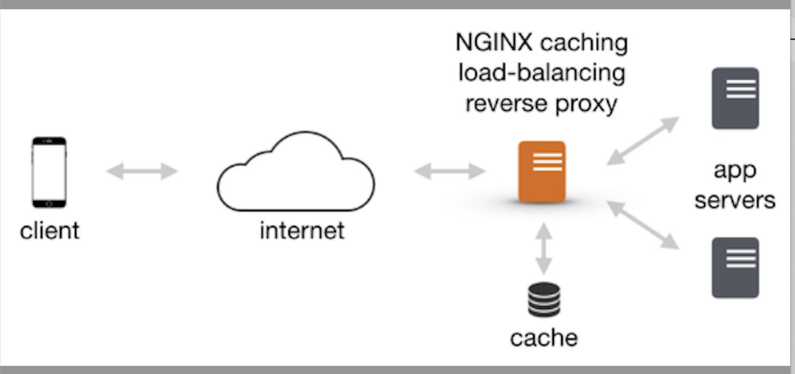

# 本文說明，本專案係參加玉山-2021 ＡI人工智慧手寫中文字辨識公開挑戰賽「API最佳服務獎」之說明文件，我們是參賽隊伍「AI-Yodass』。我們是一支產學合作的隊伍。

# 設計緣起

玉山-2021ＡI人工智慧手寫中文字辨識公開挑戰賽參賽期間，我們一直不斷地優化AI模型的精準度，導致模型愈來愈大，推論的時間也拉長，五月的測試賽原本本團隊都保持在第七名的成績，但在6月8日的加場測試賽時，我們團隊的成績竟然因為模型過大，導致推論時間過長，比賽成績還因此跌出前十名以外，因此我們開始研究如何提高api系統服務的效能與吞吐量？

# 發現問題

五月連續三天的測試賽，本團隊使用單一模型上線參賽，當時前三天成績一直穩定保持在第七名。
到了6/8的加場測試賽前一天，本團隊開始使用重新訓練的ensemble模型，在本團隊測試流程先這個模型放在gcp上運行，經測試後回應時間介於0.65~0.85秒之間，因此認為這個模型應該沒有太大問題。

但是在6/8測試賽時因為有少部份的request回應時間會大於1秒，玉山主辦單位會重送這些request，造成request量變多，回應時間變慢，所以愈來愈多timeout案例發生，最後在6/8日該場加測賽結束後，統計結果我們收到2000多筆逾時結果。
因此如何在提高模型精準度之後，亦能顧及api 服務效能，以提高服務吞吐量及響應成功率？成為我們進入正式決賽前要嚴肅面對與解決的關鍵問題。

# 最後定案的API服務架構

經過團隊的努力下，不斷地進行壓測與單元測試，我們設計採用 Docker容器技術構建多層次架構服務組態，將原本單一個Container App擴大為5個container App，並採用 Nginx Load Balance，
並加入cache機制，(如果第一次request timeout，第二次request會將第一次計算的結果直接回傳)

# API服務優化後實測結果

壓測結果顯示即使每秒同時有5個requests之下，都能在0.85秒左右回應。

# API服務優化後正式參賽結果

在6/15-6/18的正式賽，我們正式使用了 Load Balance（Nginx)+5台的 Container App 架構上線參賽。 然後我們正式賽四天各單日成績取得了第一天(6/15)第3名、第二天(6/16)第4名、第三天(6/17)第5名、第四天(6/18)奪回第1名的優異成績，最後經大會結算榮獲總亞軍的榮譽。

# 本專案的設計架構圖

# 以下為本專案開源的實作步驟

# ㄧ、創建 Dockerfile 檔案
Dockerfile 是一個文本檔案，其用來定義本專案單個容器的內容和啟動行為，按順序包含構建鏡像所需的所有指令。Docker 會通過讀取 Dockerfile 中的指令自動構建鏡像。
Dockerfile位於本層目錄下，請自行參照。

# 二、構建應用容器鏡像
在專案esun_ai_2021_summer_tradevan根目錄中，打開終端機視窗，執行如下命令構建容器鏡像：

# build docker image
cd ~/esun_ai_2021_summer_tradevan
docker image build -t hsiehpinghan/esun_ai_2021_summer_tradevan:6.0.0 .
------------------------------------------------
# 三、本地端測試環境的API服務部署

以下為開發者測試環境的本機端部署步驟，情境為於本機端測試本專案時，採用 Docker Container運行出一台負載平衡器以及對應的兩台API服務器與一個Redis緩存服務
# run local api container

## 1.以下是創建第一台 緩存服務的資料儲存區
mkdir -p /tmp/redis/data
docker run --name redis \
  --restart=always \
  -p 6379:6379 \
  -v /tmp/redis/data:/data \
  -itd \
  redis:6.2.4 redis-server --appendonly yes

docker run --rm -d \
  --link redis:redis \
  -e REDIS_1_HOST=redis \
  -e REDIS_1_NAME=redis \
  -p 18080:80 \
  erikdubbelboer/phpredisadmin:v1.13.2

## 2.以下測試redis是否正常？
http://localhost:18080/

## 3.以下是創建第一台 api server的log儲存區
mkdir -p /tmp/log_0

## 4.運行第一台 api server，取名為esun_ai_2021_summer_tradevan_0
docker run --name esun_ai_2021_summer_tradevan_0 \
  --restart=always \
  -e "TZ=Asia/Taipei" \
  -p 10080:5000 \
  -v /tmp/log_0:/log \
  --link redis:redis \
  -td hsiehpinghan/esun_ai_2021_summer_tradevan:6.0.0

## 5.以下是測試第一台api服務是否正常？用curl指令打出一筆測試請求

curl -v -X POST -H "Content-Type: application/json" -d '{"esun_uuid": "6465e4f10a0b099c44791e901efb7e8d9268b972b95b6fa53db93780b6b22fbf","esun_timestamp": 1590493849,"image": "/9j/4AAQSkZJRgABAQAAAQABAAD/2wBDAAgGBgcGBQgHBwcJCQgKDBQNDAsLDBkSEw8UHRofHh0aHBwgJC4nICIsIxwcKDcpLDAxNDQ0Hyc5PTgyPC4zNDL/2wBDAQkJCQwLDBgNDRgyIRwhMjIyMjIyMjIyMjIyMjIyMjIyMjIyMjIyMjIyMjIyMjIyMjIyMjIyMjIyMjIyMjIyMjL/wAARCABDAEEDASIAAhEBAxEB/8QAHwAAAQUBAQEBAQEAAAAAAAAAAAECAwQFBgcICQoL/8QAtRAAAgEDAwIEAwUFBAQAAAF9AQIDAAQRBRIhMUEGE1FhByJxFDKBkaEII0KxwRVS0fAkM2JyggkKFhcYGRolJicoKSo0NTY3ODk6Q0RFRkdISUpTVFVWV1hZWmNkZWZnaGlqc3R1dnd4eXqDhIWGh4iJipKTlJWWl5iZmqKjpKWmp6ipqrKztLW2t7i5usLDxMXGx8jJytLT1NXW19jZ2uHi4+Tl5ufo6erx8vP09fb3+Pn6/8QAHwEAAwEBAQEBAQEBAQAAAAAAAAECAwQFBgcICQoL/8QAtREAAgECBAQDBAcFBAQAAQJ3AAECAxEEBSExBhJBUQdhcRMiMoEIFEKRobHBCSMzUvAVYnLRChYkNOEl8RcYGRomJygpKjU2Nzg5OkNERUZHSElKU1RVVldYWVpjZGVmZ2hpanN0dXZ3eHl6goOEhYaHiImKkpOUlZaXmJmaoqOkpaanqKmqsrO0tba3uLm6wsPExcbHyMnK0tPU1dbX2Nna4uPk5ebn6Onq8vP09fb3+Pn6/9oADAMBAAIRAxEAPwC5J401/wCxu/8AYe393Cf9TN60yfxnr93bSRjRsiWZoyfJm4GD/hXpA8nLfSkRIWT8a4OWXc91YrD30pL72eZaP4o13T9It7dNH81Fhl+byZuD6VKnjHxDLbqq6HtxHCc+TN616JcRRpbuUB7ZO7aKope2M15PAk8DzKAzIsm5x25HpS5JW3E8XQf/AC6X3s4b/hM/EX2qNW0TdiaT/ljNSXHjPXwiL/Ye3epXPkzf3ga76Ty8Ls65pB/rvwpqMujB4qhdXpL72eean4j17UbV4P7H/wCWkS/6mb6/0q0vjHxCIsJo/O2Vf9TN2xXdu6Rr83c0/ZDsDetTya3bGsZRas6S+9nmH/CY+Jf+gP8A+QZqK9O/cUVXI+4/rND/AJ9L72XgsrxsD12cfnVW51m00+W2trxts8x8uL3bBx/I1Q13xJpmiwYuXyXGTH61xmkWeveK/Etrrep2qWtrbyYtN/8AEuK6YUrrmlojy5T5TsNeutZt9ORtH02K/nXKtHJ0YZrzGzfxZrviG8uLbT7G3n4hldmx5XsPyr1NtYsrS7S1nZ7eZySR/CoHU/nXl2m+Iv7O8TahNp0Uupm6nOFjfaVx6n0H9a6KClbliu+/qZyte708jpNF8E3ljdLe6prNzLceYDsWXcg47CutO95ZXyhUDAb+I81w0vj7VpoJp4NBMFvBMBNI11sIJ4rtYGSYCWI7k2hieuCR03d6wqRe8lr5GkHG2hPvlXy/K+9t5qZ5m8sbvvZqpcL50LPvdcf3P61We+tlVIvMDsE52/f/AB9qxaLS5tjS86isj7Sv/Teilp2J5H3Oqe1ikVfNjRyuCofsfX8s15mdX1HVfiX9m0y/jXS4ZgFjTsAp3frit3xadY1Bv7K0hJ4A2PPmeLag7cH1rFvPDel+GPE/h6O0j23bsfPf/nodjHNdcKajGz+J7Iy5uZ6E3i6CBdbsEmINtdQyM7HoSOOfasC78QaLourZtjGix2SojWy5RXPTPv1r0bX/AA/H4h0KWzllMcZSMlgM9M/l1rlTp3gDwtdxme7tTe2yqQfOeRgcY+4vT61dOonCz+6xTfVfecJaW+p63BpWm2lvJHbrK1xI7x7fMPTOf+BV7RaWrQwxE/8ALNPLP161laZ4o0fV5/I0m5lnCt5bsscigZ93+lbL2iSpNFKZhE48t/cH/wDVWVaV2k9BQTUWwmbYo9zWZJDG9yzw/wCsCkn6ZrjdU8P+M9E1JpND1Ca+sQSypuRdq91+b3xWz4d1LXL+5ZdQ0mSzQRn940kbbmyMcL+P5VEqdldO44TadjY856Ku+XN6UVnc25o9zfYoLfKPsGAD9a8/1sPc/FbT4ELSNaODhe2VPJruNJ0uLTLKGGE/uUXKH+9kc/0rl7eH7V8U9Qb+7FEf0rWkrc8l0MHNJp+bJvFGla1qkds2lahBZWnzefI+/cmDzjb3rmPCXhbTr+7urya2gu9Pd/3NxcJIzyAcEgP2zXY+MLmW28KXUsRwzRuh/EGodEsJV8EWdmm5Z2s0CFf4Syk/0q4t+wVtNSZTV7oZe2T2mlSJ4RttP81ZP9U42ZGD3+uOKz/D2p6nczyWmtQRWl8ilxbxvuGMgZx7ZxWboXi6Xw9Yx2Gv6fe2jpK3+kOrskg9tvesbX9Z0m58U2l7o2qSXcryBHgeORdq8ktl/cAfjVKEmmt/MObZnqEn+qH1qEJvIpkO6eFXaPYxxVvy9iA1x6p2saIZ5FFLRVXHyI23RTG5KjO70964ayVYfHmsXCqplZgCzDd296KKuHwMJ7o2Z9l7aSR3MFvKgjJAaFODuHtUpvJln2L5YVIwFHlLx+lFFRP4V6sS3Ksbi+lkhuobeaPafleBCOv0rItNJ0y21GSWDTLKORELKy26ZB49qKKr7JP2i/ZXk08s3mFDg4GI1H8hW1YxJPIRIMjb2OO/tRRULYtLQu/2da/3G/7+N/jRRRSLP//Z","retry": 2}' http://localhost:10080/inference -w %{time_connect}:%{time_starttransfer}:%{time_total}

## 6.以下是創建第二台 api server的log儲存區
mkdir -p /tmp/log_1

## 7.運行第二台 api server，取名為esun_ai_2021_summer_tradevan_1
docker run --name esun_ai_2021_summer_tradevan_1 \
  --restart=always \
  -e "TZ=Asia/Taipei" \
  -p 10081:5000 \
  -v /tmp/log_1:/log \
  --link redis:redis \
  -td hsiehpinghan/esun_ai_2021_summer_tradevan:6.0.0

## 8.以下是測試第二台api服務是否正常？用curl指令打出一筆測試請求
curl -v -X POST -H "Content-Type: application/json" -d '{"esun_uuid": "6465e4f10a0b099c44791e901efb7e8d9268b972b95b6fa53db93780b6b22fbf","esun_timestamp": 1590493849,"image": "/9j/4AAQSkZJRgABAQAAAQABAAD/2wBDAAgGBgcGBQgHBwcJCQgKDBQNDAsLDBkSEw8UHRofHh0aHBwgJC4nICIsIxwcKDcpLDAxNDQ0Hyc5PTgyPC4zNDL/2wBDAQkJCQwLDBgNDRgyIRwhMjIyMjIyMjIyMjIyMjIyMjIyMjIyMjIyMjIyMjIyMjIyMjIyMjIyMjIyMjIyMjIyMjL/wAARCABDAEEDASIAAhEBAxEB/8QAHwAAAQUBAQEBAQEAAAAAAAAAAAECAwQFBgcICQoL/8QAtRAAAgEDAwIEAwUFBAQAAAF9AQIDAAQRBRIhMUEGE1FhByJxFDKBkaEII0KxwRVS0fAkM2JyggkKFhcYGRolJicoKSo0NTY3ODk6Q0RFRkdISUpTVFVWV1hZWmNkZWZnaGlqc3R1dnd4eXqDhIWGh4iJipKTlJWWl5iZmqKjpKWmp6ipqrKztLW2t7i5usLDxMXGx8jJytLT1NXW19jZ2uHi4+Tl5ufo6erx8vP09fb3+Pn6/8QAHwEAAwEBAQEBAQEBAQAAAAAAAAECAwQFBgcICQoL/8QAtREAAgECBAQDBAcFBAQAAQJ3AAECAxEEBSExBhJBUQdhcRMiMoEIFEKRobHBCSMzUvAVYnLRChYkNOEl8RcYGRomJygpKjU2Nzg5OkNERUZHSElKU1RVVldYWVpjZGVmZ2hpanN0dXZ3eHl6goOEhYaHiImKkpOUlZaXmJmaoqOkpaanqKmqsrO0tba3uLm6wsPExcbHyMnK0tPU1dbX2Nna4uPk5ebn6Onq8vP09fb3+Pn6/9oADAMBAAIRAxEAPwC5J401/wCxu/8AYe393Cf9TN60yfxnr93bSRjRsiWZoyfJm4GD/hXpA8nLfSkRIWT8a4OWXc91YrD30pL72eZaP4o13T9It7dNH81Fhl+byZuD6VKnjHxDLbqq6HtxHCc+TN616JcRRpbuUB7ZO7aKope2M15PAk8DzKAzIsm5x25HpS5JW3E8XQf/AC6X3s4b/hM/EX2qNW0TdiaT/ljNSXHjPXwiL/Ye3epXPkzf3ga76Ty8Ls65pB/rvwpqMujB4qhdXpL72eean4j17UbV4P7H/wCWkS/6mb6/0q0vjHxCIsJo/O2Vf9TN2xXdu6Rr83c0/ZDsDetTya3bGsZRas6S+9nmH/CY+Jf+gP8A+QZqK9O/cUVXI+4/rND/AJ9L72XgsrxsD12cfnVW51m00+W2trxts8x8uL3bBx/I1Q13xJpmiwYuXyXGTH61xmkWeveK/Etrrep2qWtrbyYtN/8AEuK6YUrrmlojy5T5TsNeutZt9ORtH02K/nXKtHJ0YZrzGzfxZrviG8uLbT7G3n4hldmx5XsPyr1NtYsrS7S1nZ7eZySR/CoHU/nXl2m+Iv7O8TahNp0Uupm6nOFjfaVx6n0H9a6KClbliu+/qZyte708jpNF8E3ljdLe6prNzLceYDsWXcg47CutO95ZXyhUDAb+I81w0vj7VpoJp4NBMFvBMBNI11sIJ4rtYGSYCWI7k2hieuCR03d6wqRe8lr5GkHG2hPvlXy/K+9t5qZ5m8sbvvZqpcL50LPvdcf3P61We+tlVIvMDsE52/f/AB9qxaLS5tjS86isj7Sv/Teilp2J5H3Oqe1ikVfNjRyuCofsfX8s15mdX1HVfiX9m0y/jXS4ZgFjTsAp3frit3xadY1Bv7K0hJ4A2PPmeLag7cH1rFvPDel+GPE/h6O0j23bsfPf/nodjHNdcKajGz+J7Iy5uZ6E3i6CBdbsEmINtdQyM7HoSOOfasC78QaLourZtjGix2SojWy5RXPTPv1r0bX/AA/H4h0KWzllMcZSMlgM9M/l1rlTp3gDwtdxme7tTe2yqQfOeRgcY+4vT61dOonCz+6xTfVfecJaW+p63BpWm2lvJHbrK1xI7x7fMPTOf+BV7RaWrQwxE/8ALNPLP161laZ4o0fV5/I0m5lnCt5bsscigZ93+lbL2iSpNFKZhE48t/cH/wDVWVaV2k9BQTUWwmbYo9zWZJDG9yzw/wCsCkn6ZrjdU8P+M9E1JpND1Ca+sQSypuRdq91+b3xWz4d1LXL+5ZdQ0mSzQRn940kbbmyMcL+P5VEqdldO44TadjY856Ku+XN6UVnc25o9zfYoLfKPsGAD9a8/1sPc/FbT4ELSNaODhe2VPJruNJ0uLTLKGGE/uUXKH+9kc/0rl7eH7V8U9Qb+7FEf0rWkrc8l0MHNJp+bJvFGla1qkds2lahBZWnzefI+/cmDzjb3rmPCXhbTr+7urya2gu9Pd/3NxcJIzyAcEgP2zXY+MLmW28KXUsRwzRuh/EGodEsJV8EWdmm5Z2s0CFf4Syk/0q4t+wVtNSZTV7oZe2T2mlSJ4RttP81ZP9U42ZGD3+uOKz/D2p6nczyWmtQRWl8ilxbxvuGMgZx7ZxWboXi6Xw9Yx2Gv6fe2jpK3+kOrskg9tvesbX9Z0m58U2l7o2qSXcryBHgeORdq8ktl/cAfjVKEmmt/MObZnqEn+qH1qEJvIpkO6eFXaPYxxVvy9iA1x6p2saIZ5FFLRVXHyI23RTG5KjO70964ayVYfHmsXCqplZgCzDd296KKuHwMJ7o2Z9l7aSR3MFvKgjJAaFODuHtUpvJln2L5YVIwFHlLx+lFFRP4V6sS3Ksbi+lkhuobeaPafleBCOv0rItNJ0y21GSWDTLKORELKy26ZB49qKKr7JP2i/ZXk08s3mFDg4GI1H8hW1YxJPIRIMjb2OO/tRRULYtLQu/2da/3G/7+N/jRRRSLP//Z","retry": 2}' http://localhost:10081/inference -w %{time_connect}:%{time_starttransfer}:%{time_total}

# 9.創建負載平衡器
## 創建一台負載平衡器，取名為 load_balance，負載平衡器之後自動串連兩台api server虛擬機
docker run --name load_balance \
  --restart=always \
  -d \
  -p 80:80 \
  --link esun_ai_2021_summer_tradevan_0:esun_ai_2021_summer_tradevan_0 \
  --link esun_ai_2021_summer_tradevan_1:esun_ai_2021_summer_tradevan_1 \
  -v /home/hsiehpinghan/git/esun_ai_2021_summer_tradevan/nginx/nginx.conf:/etc/nginx/nginx.conf:ro \
  nginx:1.15.8-alpine

## 10.以下是測試負載平衡器服務是否正常？用curl指令打出一筆測試請求
curl -v -X POST -H "Content-Type: application/json" -d '{"esun_uuid": "6465e4f10a0b099c44791e901efb7e8d9268b972b95b6fa53db93780b6b22fbf","esun_timestamp": 1590493849,"image": "/9j/4AAQSkZJRgABAQAAAQABAAD/2wBDAAgGBgcGBQgHBwcJCQgKDBQNDAsLDBkSEw8UHRofHh0aHBwgJC4nICIsIxwcKDcpLDAxNDQ0Hyc5PTgyPC4zNDL/2wBDAQkJCQwLDBgNDRgyIRwhMjIyMjIyMjIyMjIyMjIyMjIyMjIyMjIyMjIyMjIyMjIyMjIyMjIyMjIyMjIyMjIyMjL/wAARCABDAEEDASIAAhEBAxEB/8QAHwAAAQUBAQEBAQEAAAAAAAAAAAECAwQFBgcICQoL/8QAtRAAAgEDAwIEAwUFBAQAAAF9AQIDAAQRBRIhMUEGE1FhByJxFDKBkaEII0KxwRVS0fAkM2JyggkKFhcYGRolJicoKSo0NTY3ODk6Q0RFRkdISUpTVFVWV1hZWmNkZWZnaGlqc3R1dnd4eXqDhIWGh4iJipKTlJWWl5iZmqKjpKWmp6ipqrKztLW2t7i5usLDxMXGx8jJytLT1NXW19jZ2uHi4+Tl5ufo6erx8vP09fb3+Pn6/8QAHwEAAwEBAQEBAQEBAQAAAAAAAAECAwQFBgcICQoL/8QAtREAAgECBAQDBAcFBAQAAQJ3AAECAxEEBSExBhJBUQdhcRMiMoEIFEKRobHBCSMzUvAVYnLRChYkNOEl8RcYGRomJygpKjU2Nzg5OkNERUZHSElKU1RVVldYWVpjZGVmZ2hpanN0dXZ3eHl6goOEhYaHiImKkpOUlZaXmJmaoqOkpaanqKmqsrO0tba3uLm6wsPExcbHyMnK0tPU1dbX2Nna4uPk5ebn6Onq8vP09fb3+Pn6/9oADAMBAAIRAxEAPwC5J401/wCxu/8AYe393Cf9TN60yfxnr93bSRjRsiWZoyfJm4GD/hXpA8nLfSkRIWT8a4OWXc91YrD30pL72eZaP4o13T9It7dNH81Fhl+byZuD6VKnjHxDLbqq6HtxHCc+TN616JcRRpbuUB7ZO7aKope2M15PAk8DzKAzIsm5x25HpS5JW3E8XQf/AC6X3s4b/hM/EX2qNW0TdiaT/ljNSXHjPXwiL/Ye3epXPkzf3ga76Ty8Ls65pB/rvwpqMujB4qhdXpL72eean4j17UbV4P7H/wCWkS/6mb6/0q0vjHxCIsJo/O2Vf9TN2xXdu6Rr83c0/ZDsDetTya3bGsZRas6S+9nmH/CY+Jf+gP8A+QZqK9O/cUVXI+4/rND/AJ9L72XgsrxsD12cfnVW51m00+W2trxts8x8uL3bBx/I1Q13xJpmiwYuXyXGTH61xmkWeveK/Etrrep2qWtrbyYtN/8AEuK6YUrrmlojy5T5TsNeutZt9ORtH02K/nXKtHJ0YZrzGzfxZrviG8uLbT7G3n4hldmx5XsPyr1NtYsrS7S1nZ7eZySR/CoHU/nXl2m+Iv7O8TahNp0Uupm6nOFjfaVx6n0H9a6KClbliu+/qZyte708jpNF8E3ljdLe6prNzLceYDsWXcg47CutO95ZXyhUDAb+I81w0vj7VpoJp4NBMFvBMBNI11sIJ4rtYGSYCWI7k2hieuCR03d6wqRe8lr5GkHG2hPvlXy/K+9t5qZ5m8sbvvZqpcL50LPvdcf3P61We+tlVIvMDsE52/f/AB9qxaLS5tjS86isj7Sv/Teilp2J5H3Oqe1ikVfNjRyuCofsfX8s15mdX1HVfiX9m0y/jXS4ZgFjTsAp3frit3xadY1Bv7K0hJ4A2PPmeLag7cH1rFvPDel+GPE/h6O0j23bsfPf/nodjHNdcKajGz+J7Iy5uZ6E3i6CBdbsEmINtdQyM7HoSOOfasC78QaLourZtjGix2SojWy5RXPTPv1r0bX/AA/H4h0KWzllMcZSMlgM9M/l1rlTp3gDwtdxme7tTe2yqQfOeRgcY+4vT61dOonCz+6xTfVfecJaW+p63BpWm2lvJHbrK1xI7x7fMPTOf+BV7RaWrQwxE/8ALNPLP161laZ4o0fV5/I0m5lnCt5bsscigZ93+lbL2iSpNFKZhE48t/cH/wDVWVaV2k9BQTUWwmbYo9zWZJDG9yzw/wCsCkn6ZrjdU8P+M9E1JpND1Ca+sQSypuRdq91+b3xWz4d1LXL+5ZdQ0mSzQRn940kbbmyMcL+P5VEqdldO44TadjY856Ku+XN6UVnc25o9zfYoLfKPsGAD9a8/1sPc/FbT4ELSNaODhe2VPJruNJ0uLTLKGGE/uUXKH+9kc/0rl7eH7V8U9Qb+7FEf0rWkrc8l0MHNJp+bJvFGla1qkds2lahBZWnzefI+/cmDzjb3rmPCXhbTr+7urya2gu9Pd/3NxcJIzyAcEgP2zXY+MLmW28KXUsRwzRuh/EGodEsJV8EWdmm5Z2s0CFf4Syk/0q4t+wVtNSZTV7oZe2T2mlSJ4RttP81ZP9U42ZGD3+uOKz/D2p6nczyWmtQRWl8ilxbxvuGMgZx7ZxWboXi6Xw9Yx2Gv6fe2jpK3+kOrskg9tvesbX9Z0m58U2l7o2qSXcryBHgeORdq8ktl/cAfjVKEmmt/MObZnqEn+qH1qEJvIpkO6eFXaPYxxVvy9iA1x6p2saIZ5FFLRVXHyI23RTG5KjO70964ayVYfHmsXCqplZgCzDd296KKuHwMJ7o2Z9l7aSR3MFvKgjJAaFODuHtUpvJln2L5YVIwFHlLx+lFFRP4V6sS3Ksbi+lkhuobeaPafleBCOv0rItNJ0y21GSWDTLKORELKy26ZB49qKKr7JP2i/ZXk08s3mFDg4GI1H8hW1YxJPIRIMjb2OO/tRRULYtLQu/2da/3G/7+N/jRRRSLP//Z","retry": 2}' http://localhost:80/inference -w %{time_connect}:%{time_starttransfer}:%{time_total}

# 11.推送核心映像檔
將本專案的核心映像檔上傳至個人的docker hub倉庫帳號下，備份存檔。請替換成用戶自己的帳號
# push to docker hub
docker login
docker tag hsiehpinghan/esun_ai_2021_summer_tradevan:6.0.0  user_account/esun_ai_2021_summer_tradevan:6.0.0
docker push user_account/esun_ai_2021_summer_tradevan:6.0.0

-----------------------------------------------------------
# 四、以下為生產環境的部署步驟，基本上與本機端的測試部署相似，差別為生產環境上擴增為5台Container API server

# run production container
mkdir -p /tmp/redis/data
docker run --name redis \
  --restart=always \
  -v /tmp/redis/data:/data \
  -itd \
  redis:6.2.4 redis-server --appendonly yes
mkdir -p /log/log_0
docker run --name esun_ai_2021_summer_tradevan_0 \
  --restart=always \
  -e "TZ=Asia/Taipei" \
  -v /log/log_0:/log \
  --link redis:redis \
  -td hsiehpinghan/esun_ai_2021_summer_tradevan:6.0.0
mkdir -p /log/log_1
docker run --name esun_ai_2021_summer_tradevan_1 \
  --restart=always \
  -e "TZ=Asia/Taipei" \
  -v /log/log_1:/log \
  --link redis:redis \
  -td hsiehpinghan/esun_ai_2021_summer_tradevan:6.0.0
mkdir -p /log/log_2
docker run --name esun_ai_2021_summer_tradevan_2 \
  --restart=always \
  -e "TZ=Asia/Taipei" \
  -v /log/log_2:/log \
  --link redis:redis \
  -td hsiehpinghan/esun_ai_2021_summer_tradevan:6.0.0
mkdir -p /log/log_3
docker run --name esun_ai_2021_summer_tradevan_3 \
  --restart=always \
  -e "TZ=Asia/Taipei" \
  -v /log/log_3:/log \
  --link redis:redis \
  -td hsiehpinghan/esun_ai_2021_summer_tradevan:6.0.0
mkdir -p /log/log_4
docker run --name esun_ai_2021_summer_tradevan_4 \
  --restart=always \
  -e "TZ=Asia/Taipei" \
  -v /log/log_4:/log \
  --link redis:redis \
  -td hsiehpinghan/esun_ai_2021_summer_tradevan:6.0.0
vi /root/nginx.conf
  events {
      worker_connections  1024;
  }

  http {
    upstream my_upstream {
      server esun_ai_2021_summer_tradevan_0:5000;
      server esun_ai_2021_summer_tradevan_1:5000;
      server esun_ai_2021_summer_tradevan_2:5000;
      server esun_ai_2021_summer_tradevan_3:5000;
      server esun_ai_2021_summer_tradevan_4:5000;
    }
    server {
      listen 80;

      location / {
        proxy_pass http://my_upstream;
      }
    }
  }
docker run --name load_balance \
  --restart=always \
  -d \
  -p 80:80 \
  --link esun_ai_2021_summer_tradevan_0:esun_ai_2021_summer_tradevan_0 \
  --link esun_ai_2021_summer_tradevan_1:esun_ai_2021_summer_tradevan_1 \
  --link esun_ai_2021_summer_tradevan_2:esun_ai_2021_summer_tradevan_2 \
  --link esun_ai_2021_summer_tradevan_3:esun_ai_2021_summer_tradevan_3 \
  --link esun_ai_2021_summer_tradevan_4:esun_ai_2021_summer_tradevan_4 \
  -v /root/nginx.conf:/etc/nginx/nginx.conf:ro \
  nginx:1.15.8-alpine
curl -v -X POST -H "Content-Type: application/json" -d '{"esun_uuid": "6465e4f10a0b099c44791e901efb7e8d9268b972b95b6fa53db93780b6b22fbf","esun_timestamp": 1590493849,"image": "/9j/4AAQSkZJRgABAQAAAQABAAD/2wBDAAgGBgcGBQgHBwcJCQgKDBQNDAsLDBkSEw8UHRofHh0aHBwgJC4nICIsIxwcKDcpLDAxNDQ0Hyc5PTgyPC4zNDL/2wBDAQkJCQwLDBgNDRgyIRwhMjIyMjIyMjIyMjIyMjIyMjIyMjIyMjIyMjIyMjIyMjIyMjIyMjIyMjIyMjIyMjIyMjL/wAARCABDAEEDASIAAhEBAxEB/8QAHwAAAQUBAQEBAQEAAAAAAAAAAAECAwQFBgcICQoL/8QAtRAAAgEDAwIEAwUFBAQAAAF9AQIDAAQRBRIhMUEGE1FhByJxFDKBkaEII0KxwRVS0fAkM2JyggkKFhcYGRolJicoKSo0NTY3ODk6Q0RFRkdISUpTVFVWV1hZWmNkZWZnaGlqc3R1dnd4eXqDhIWGh4iJipKTlJWWl5iZmqKjpKWmp6ipqrKztLW2t7i5usLDxMXGx8jJytLT1NXW19jZ2uHi4+Tl5ufo6erx8vP09fb3+Pn6/8QAHwEAAwEBAQEBAQEBAQAAAAAAAAECAwQFBgcICQoL/8QAtREAAgECBAQDBAcFBAQAAQJ3AAECAxEEBSExBhJBUQdhcRMiMoEIFEKRobHBCSMzUvAVYnLRChYkNOEl8RcYGRomJygpKjU2Nzg5OkNERUZHSElKU1RVVldYWVpjZGVmZ2hpanN0dXZ3eHl6goOEhYaHiImKkpOUlZaXmJmaoqOkpaanqKmqsrO0tba3uLm6wsPExcbHyMnK0tPU1dbX2Nna4uPk5ebn6Onq8vP09fb3+Pn6/9oADAMBAAIRAxEAPwC5J401/wCxu/8AYe393Cf9TN60yfxnr93bSRjRsiWZoyfJm4GD/hXpA8nLfSkRIWT8a4OWXc91YrD30pL72eZaP4o13T9It7dNH81Fhl+byZuD6VKnjHxDLbqq6HtxHCc+TN616JcRRpbuUB7ZO7aKope2M15PAk8DzKAzIsm5x25HpS5JW3E8XQf/AC6X3s4b/hM/EX2qNW0TdiaT/ljNSXHjPXwiL/Ye3epXPkzf3ga76Ty8Ls65pB/rvwpqMujB4qhdXpL72eean4j17UbV4P7H/wCWkS/6mb6/0q0vjHxCIsJo/O2Vf9TN2xXdu6Rr83c0/ZDsDetTya3bGsZRas6S+9nmH/CY+Jf+gP8A+QZqK9O/cUVXI+4/rND/AJ9L72XgsrxsD12cfnVW51m00+W2trxts8x8uL3bBx/I1Q13xJpmiwYuXyXGTH61xmkWeveK/Etrrep2qWtrbyYtN/8AEuK6YUrrmlojy5T5TsNeutZt9ORtH02K/nXKtHJ0YZrzGzfxZrviG8uLbT7G3n4hldmx5XsPyr1NtYsrS7S1nZ7eZySR/CoHU/nXl2m+Iv7O8TahNp0Uupm6nOFjfaVx6n0H9a6KClbliu+/qZyte708jpNF8E3ljdLe6prNzLceYDsWXcg47CutO95ZXyhUDAb+I81w0vj7VpoJp4NBMFvBMBNI11sIJ4rtYGSYCWI7k2hieuCR03d6wqRe8lr5GkHG2hPvlXy/K+9t5qZ5m8sbvvZqpcL50LPvdcf3P61We+tlVIvMDsE52/f/AB9qxaLS5tjS86isj7Sv/Teilp2J5H3Oqe1ikVfNjRyuCofsfX8s15mdX1HVfiX9m0y/jXS4ZgFjTsAp3frit3xadY1Bv7K0hJ4A2PPmeLag7cH1rFvPDel+GPE/h6O0j23bsfPf/nodjHNdcKajGz+J7Iy5uZ6E3i6CBdbsEmINtdQyM7HoSOOfasC78QaLourZtjGix2SojWy5RXPTPv1r0bX/AA/H4h0KWzllMcZSMlgM9M/l1rlTp3gDwtdxme7tTe2yqQfOeRgcY+4vT61dOonCz+6xTfVfecJaW+p63BpWm2lvJHbrK1xI7x7fMPTOf+BV7RaWrQwxE/8ALNPLP161laZ4o0fV5/I0m5lnCt5bsscigZ93+lbL2iSpNFKZhE48t/cH/wDVWVaV2k9BQTUWwmbYo9zWZJDG9yzw/wCsCkn6ZrjdU8P+M9E1JpND1Ca+sQSypuRdq91+b3xWz4d1LXL+5ZdQ0mSzQRn940kbbmyMcL+P5VEqdldO44TadjY856Ku+XN6UVnc25o9zfYoLfKPsGAD9a8/1sPc/FbT4ELSNaODhe2VPJruNJ0uLTLKGGE/uUXKH+9kc/0rl7eH7V8U9Qb+7FEf0rWkrc8l0MHNJp+bJvFGla1qkds2lahBZWnzefI+/cmDzjb3rmPCXhbTr+7urya2gu9Pd/3NxcJIzyAcEgP2zXY+MLmW28KXUsRwzRuh/EGodEsJV8EWdmm5Z2s0CFf4Syk/0q4t+wVtNSZTV7oZe2T2mlSJ4RttP81ZP9U42ZGD3+uOKz/D2p6nczyWmtQRWl8ilxbxvuGMgZx7ZxWboXi6Xw9Yx2Gv6fe2jpK3+kOrskg9tvesbX9Z0m58U2l7o2qSXcryBHgeORdq8ktl/cAfjVKEmmt/MObZnqEn+qH1qEJvIpkO6eFXaPYxxVvy9iA1x6p2saIZ5FFLRVXHyI23RTG5KjO70964ayVYfHmsXCqplZgCzDd296KKuHwMJ7o2Z9l7aSR3MFvKgjJAaFODuHtUpvJln2L5YVIwFHlLx+lFFRP4V6sS3Ksbi+lkhuobeaPafleBCOv0rItNJ0y21GSWDTLKORELKy26ZB49qKKr7JP2i/ZXk08s3mFDg4GI1H8hW1YxJPIRIMjb2OO/tRRULYtLQu/2da/3G/7+N/jRRRSLP//Z","retry": 2}' http://211.75.194.26/inference -w %{time_connect}:%{time_starttransfer}:%{time_total}
curl -v -X POST -H "Content-Type: application/json" -d '{"esun_uuid": "6465e4f10a0b099c44791e901efb7e8d9268b972b95b6fa53db93780b6b22fbf","esun_timestamp": 1590493849,"image": "/9j/4AAQSkZJRgABAQAAAQABAAD/2wBDAAgGBgcGBQgHBwcJCQgKDBQNDAsLDBkSEw8UHRofHh0aHBwgJC4nICIsIxwcKDcpLDAxNDQ0Hyc5PTgyPC4zNDL/2wBDAQkJCQwLDBgNDRgyIRwhMjIyMjIyMjIyMjIyMjIyMjIyMjIyMjIyMjIyMjIyMjIyMjIyMjIyMjIyMjIyMjIyMjL/wAARCABDAEEDASIAAhEBAxEB/8QAHwAAAQUBAQEBAQEAAAAAAAAAAAECAwQFBgcICQoL/8QAtRAAAgEDAwIEAwUFBAQAAAF9AQIDAAQRBRIhMUEGE1FhByJxFDKBkaEII0KxwRVS0fAkM2JyggkKFhcYGRolJicoKSo0NTY3ODk6Q0RFRkdISUpTVFVWV1hZWmNkZWZnaGlqc3R1dnd4eXqDhIWGh4iJipKTlJWWl5iZmqKjpKWmp6ipqrKztLW2t7i5usLDxMXGx8jJytLT1NXW19jZ2uHi4+Tl5ufo6erx8vP09fb3+Pn6/8QAHwEAAwEBAQEBAQEBAQAAAAAAAAECAwQFBgcICQoL/8QAtREAAgECBAQDBAcFBAQAAQJ3AAECAxEEBSExBhJBUQdhcRMiMoEIFEKRobHBCSMzUvAVYnLRChYkNOEl8RcYGRomJygpKjU2Nzg5OkNERUZHSElKU1RVVldYWVpjZGVmZ2hpanN0dXZ3eHl6goOEhYaHiImKkpOUlZaXmJmaoqOkpaanqKmqsrO0tba3uLm6wsPExcbHyMnK0tPU1dbX2Nna4uPk5ebn6Onq8vP09fb3+Pn6/9oADAMBAAIRAxEAPwC5J401/wCxu/8AYe393Cf9TN60yfxnr93bSRjRsiWZoyfJm4GD/hXpA8nLfSkRIWT8a4OWXc91YrD30pL72eZaP4o13T9It7dNH81Fhl+byZuD6VKnjHxDLbqq6HtxHCc+TN616JcRRpbuUB7ZO7aKope2M15PAk8DzKAzIsm5x25HpS5JW3E8XQf/AC6X3s4b/hM/EX2qNW0TdiaT/ljNSXHjPXwiL/Ye3epXPkzf3ga76Ty8Ls65pB/rvwpqMujB4qhdXpL72eean4j17UbV4P7H/wCWkS/6mb6/0q0vjHxCIsJo/O2Vf9TN2xXdu6Rr83c0/ZDsDetTya3bGsZRas6S+9nmH/CY+Jf+gP8A+QZqK9O/cUVXI+4/rND/AJ9L72XgsrxsD12cfnVW51m00+W2trxts8x8uL3bBx/I1Q13xJpmiwYuXyXGTH61xmkWeveK/Etrrep2qWtrbyYtN/8AEuK6YUrrmlojy5T5TsNeutZt9ORtH02K/nXKtHJ0YZrzGzfxZrviG8uLbT7G3n4hldmx5XsPyr1NtYsrS7S1nZ7eZySR/CoHU/nXl2m+Iv7O8TahNp0Uupm6nOFjfaVx6n0H9a6KClbliu+/qZyte708jpNF8E3ljdLe6prNzLceYDsWXcg47CutO95ZXyhUDAb+I81w0vj7VpoJp4NBMFvBMBNI11sIJ4rtYGSYCWI7k2hieuCR03d6wqRe8lr5GkHG2hPvlXy/K+9t5qZ5m8sbvvZqpcL50LPvdcf3P61We+tlVIvMDsE52/f/AB9qxaLS5tjS86isj7Sv/Teilp2J5H3Oqe1ikVfNjRyuCofsfX8s15mdX1HVfiX9m0y/jXS4ZgFjTsAp3frit3xadY1Bv7K0hJ4A2PPmeLag7cH1rFvPDel+GPE/h6O0j23bsfPf/nodjHNdcKajGz+J7Iy5uZ6E3i6CBdbsEmINtdQyM7HoSOOfasC78QaLourZtjGix2SojWy5RXPTPv1r0bX/AA/H4h0KWzllMcZSMlgM9M/l1rlTp3gDwtdxme7tTe2yqQfOeRgcY+4vT61dOonCz+6xTfVfecJaW+p63BpWm2lvJHbrK1xI7x7fMPTOf+BV7RaWrQwxE/8ALNPLP161laZ4o0fV5/I0m5lnCt5bsscigZ93+lbL2iSpNFKZhE48t/cH/wDVWVaV2k9BQTUWwmbYo9zWZJDG9yzw/wCsCkn6ZrjdU8P+M9E1JpND1Ca+sQSypuRdq91+b3xWz4d1LXL+5ZdQ0mSzQRn940kbbmyMcL+P5VEqdldO44TadjY856Ku+XN6UVnc25o9zfYoLfKPsGAD9a8/1sPc/FbT4ELSNaODhe2VPJruNJ0uLTLKGGE/uUXKH+9kc/0rl7eH7V8U9Qb+7FEf0rWkrc8l0MHNJp+bJvFGla1qkds2lahBZWnzefI+/cmDzjb3rmPCXhbTr+7urya2gu9Pd/3NxcJIzyAcEgP2zXY+MLmW28KXUsRwzRuh/EGodEsJV8EWdmm5Z2s0CFf4Syk/0q4t+wVtNSZTV7oZe2T2mlSJ4RttP81ZP9U42ZGD3+uOKz/D2p6nczyWmtQRWl8ilxbxvuGMgZx7ZxWboXi6Xw9Yx2Gv6fe2jpK3+kOrskg9tvesbX9Z0m58U2l7o2qSXcryBHgeORdq8ktl/cAfjVKEmmt/MObZnqEn+qH1qEJvIpkO6eFXaPYxxVvy9iA1x6p2saIZ5FFLRVXHyI23RTG5KjO70964ayVYfHmsXCqplZgCzDd296KKuHwMJ7o2Z9l7aSR3MFvKgjJAaFODuHtUpvJln2L5YVIwFHlLx+lFFRP4V6sS3Ksbi+lkhuobeaPafleBCOv0rItNJ0y21GSWDTLKORELKy26ZB49qKKr7JP2i/ZXk08s3mFDg4GI1H8hW1YxJPIRIMjb2OO/tRRULYtLQu/2da/3G/7+N/jRRRSLP//Z","retry": 2}' http://211.75.194.26/inference -w %{time_connect}:%{time_starttransfer}:%{time_total}
curl -v -X POST -H "Content-Type: application/json" -d '{"esun_uuid": "6465e4f10a0b099c44791e901efb7e8d9268b972b95b6fa53db93780b6b22fbf","esun_timestamp": 1590493849,"image": "/9j/4AAQSkZJRgABAQAAAQABAAD/2wBDAAgGBgcGBQgHBwcJCQgKDBQNDAsLDBkSEw8UHRofHh0aHBwgJC4nICIsIxwcKDcpLDAxNDQ0Hyc5PTgyPC4zNDL/2wBDAQkJCQwLDBgNDRgyIRwhMjIyMjIyMjIyMjIyMjIyMjIyMjIyMjIyMjIyMjIyMjIyMjIyMjIyMjIyMjIyMjIyMjL/wAARCABDAEEDASIAAhEBAxEB/8QAHwAAAQUBAQEBAQEAAAAAAAAAAAECAwQFBgcICQoL/8QAtRAAAgEDAwIEAwUFBAQAAAF9AQIDAAQRBRIhMUEGE1FhByJxFDKBkaEII0KxwRVS0fAkM2JyggkKFhcYGRolJicoKSo0NTY3ODk6Q0RFRkdISUpTVFVWV1hZWmNkZWZnaGlqc3R1dnd4eXqDhIWGh4iJipKTlJWWl5iZmqKjpKWmp6ipqrKztLW2t7i5usLDxMXGx8jJytLT1NXW19jZ2uHi4+Tl5ufo6erx8vP09fb3+Pn6/8QAHwEAAwEBAQEBAQEBAQAAAAAAAAECAwQFBgcICQoL/8QAtREAAgECBAQDBAcFBAQAAQJ3AAECAxEEBSExBhJBUQdhcRMiMoEIFEKRobHBCSMzUvAVYnLRChYkNOEl8RcYGRomJygpKjU2Nzg5OkNERUZHSElKU1RVVldYWVpjZGVmZ2hpanN0dXZ3eHl6goOEhYaHiImKkpOUlZaXmJmaoqOkpaanqKmqsrO0tba3uLm6wsPExcbHyMnK0tPU1dbX2Nna4uPk5ebn6Onq8vP09fb3+Pn6/9oADAMBAAIRAxEAPwC5J401/wCxu/8AYe393Cf9TN60yfxnr93bSRjRsiWZoyfJm4GD/hXpA8nLfSkRIWT8a4OWXc91YrD30pL72eZaP4o13T9It7dNH81Fhl+byZuD6VKnjHxDLbqq6HtxHCc+TN616JcRRpbuUB7ZO7aKope2M15PAk8DzKAzIsm5x25HpS5JW3E8XQf/AC6X3s4b/hM/EX2qNW0TdiaT/ljNSXHjPXwiL/Ye3epXPkzf3ga76Ty8Ls65pB/rvwpqMujB4qhdXpL72eean4j17UbV4P7H/wCWkS/6mb6/0q0vjHxCIsJo/O2Vf9TN2xXdu6Rr83c0/ZDsDetTya3bGsZRas6S+9nmH/CY+Jf+gP8A+QZqK9O/cUVXI+4/rND/AJ9L72XgsrxsD12cfnVW51m00+W2trxts8x8uL3bBx/I1Q13xJpmiwYuXyXGTH61xmkWeveK/Etrrep2qWtrbyYtN/8AEuK6YUrrmlojy5T5TsNeutZt9ORtH02K/nXKtHJ0YZrzGzfxZrviG8uLbT7G3n4hldmx5XsPyr1NtYsrS7S1nZ7eZySR/CoHU/nXl2m+Iv7O8TahNp0Uupm6nOFjfaVx6n0H9a6KClbliu+/qZyte708jpNF8E3ljdLe6prNzLceYDsWXcg47CutO95ZXyhUDAb+I81w0vj7VpoJp4NBMFvBMBNI11sIJ4rtYGSYCWI7k2hieuCR03d6wqRe8lr5GkHG2hPvlXy/K+9t5qZ5m8sbvvZqpcL50LPvdcf3P61We+tlVIvMDsE52/f/AB9qxaLS5tjS86isj7Sv/Teilp2J5H3Oqe1ikVfNjRyuCofsfX8s15mdX1HVfiX9m0y/jXS4ZgFjTsAp3frit3xadY1Bv7K0hJ4A2PPmeLag7cH1rFvPDel+GPE/h6O0j23bsfPf/nodjHNdcKajGz+J7Iy5uZ6E3i6CBdbsEmINtdQyM7HoSOOfasC78QaLourZtjGix2SojWy5RXPTPv1r0bX/AA/H4h0KWzllMcZSMlgM9M/l1rlTp3gDwtdxme7tTe2yqQfOeRgcY+4vT61dOonCz+6xTfVfecJaW+p63BpWm2lvJHbrK1xI7x7fMPTOf+BV7RaWrQwxE/8ALNPLP161laZ4o0fV5/I0m5lnCt5bsscigZ93+lbL2iSpNFKZhE48t/cH/wDVWVaV2k9BQTUWwmbYo9zWZJDG9yzw/wCsCkn6ZrjdU8P+M9E1JpND1Ca+sQSypuRdq91+b3xWz4d1LXL+5ZdQ0mSzQRn940kbbmyMcL+P5VEqdldO44TadjY856Ku+XN6UVnc25o9zfYoLfKPsGAD9a8/1sPc/FbT4ELSNaODhe2VPJruNJ0uLTLKGGE/uUXKH+9kc/0rl7eH7V8U9Qb+7FEf0rWkrc8l0MHNJp+bJvFGla1qkds2lahBZWnzefI+/cmDzjb3rmPCXhbTr+7urya2gu9Pd/3NxcJIzyAcEgP2zXY+MLmW28KXUsRwzRuh/EGodEsJV8EWdmm5Z2s0CFf4Syk/0q4t+wVtNSZTV7oZe2T2mlSJ4RttP81ZP9U42ZGD3+uOKz/D2p6nczyWmtQRWl8ilxbxvuGMgZx7ZxWboXi6Xw9Yx2Gv6fe2jpK3+kOrskg9tvesbX9Z0m58U2l7o2qSXcryBHgeORdq8ktl/cAfjVKEmmt/MObZnqEn+qH1qEJvIpkO6eFXaPYxxVvy9iA1x6p2saIZ5FFLRVXHyI23RTG5KjO70964ayVYfHmsXCqplZgCzDd296KKuHwMJ7o2Z9l7aSR3MFvKgjJAaFODuHtUpvJln2L5YVIwFHlLx+lFFRP4V6sS3Ksbi+lkhuobeaPafleBCOv0rItNJ0y21GSWDTLKORELKy26ZB49qKKr7JP2i/ZXk08s3mFDg4GI1H8hW1YxJPIRIMjb2OO/tRRULYtLQu/2da/3G/7+N/jRRRSLP//Z","retry": 2}' http://211.75.194.26/inference -w %{time_connect}:%{time_starttransfer}:%{time_total}
curl -v -X POST -H "Content-Type: application/json" -d '{"esun_uuid": "6465e4f10a0b099c44791e901efb7e8d9268b972b95b6fa53db93780b6b22fbf","esun_timestamp": 1590493849,"image": "/9j/4AAQSkZJRgABAQAAAQABAAD/2wBDAAgGBgcGBQgHBwcJCQgKDBQNDAsLDBkSEw8UHRofHh0aHBwgJC4nICIsIxwcKDcpLDAxNDQ0Hyc5PTgyPC4zNDL/2wBDAQkJCQwLDBgNDRgyIRwhMjIyMjIyMjIyMjIyMjIyMjIyMjIyMjIyMjIyMjIyMjIyMjIyMjIyMjIyMjIyMjIyMjL/wAARCABDAEEDASIAAhEBAxEB/8QAHwAAAQUBAQEBAQEAAAAAAAAAAAECAwQFBgcICQoL/8QAtRAAAgEDAwIEAwUFBAQAAAF9AQIDAAQRBRIhMUEGE1FhByJxFDKBkaEII0KxwRVS0fAkM2JyggkKFhcYGRolJicoKSo0NTY3ODk6Q0RFRkdISUpTVFVWV1hZWmNkZWZnaGlqc3R1dnd4eXqDhIWGh4iJipKTlJWWl5iZmqKjpKWmp6ipqrKztLW2t7i5usLDxMXGx8jJytLT1NXW19jZ2uHi4+Tl5ufo6erx8vP09fb3+Pn6/8QAHwEAAwEBAQEBAQEBAQAAAAAAAAECAwQFBgcICQoL/8QAtREAAgECBAQDBAcFBAQAAQJ3AAECAxEEBSExBhJBUQdhcRMiMoEIFEKRobHBCSMzUvAVYnLRChYkNOEl8RcYGRomJygpKjU2Nzg5OkNERUZHSElKU1RVVldYWVpjZGVmZ2hpanN0dXZ3eHl6goOEhYaHiImKkpOUlZaXmJmaoqOkpaanqKmqsrO0tba3uLm6wsPExcbHyMnK0tPU1dbX2Nna4uPk5ebn6Onq8vP09fb3+Pn6/9oADAMBAAIRAxEAPwC5J401/wCxu/8AYe393Cf9TN60yfxnr93bSRjRsiWZoyfJm4GD/hXpA8nLfSkRIWT8a4OWXc91YrD30pL72eZaP4o13T9It7dNH81Fhl+byZuD6VKnjHxDLbqq6HtxHCc+TN616JcRRpbuUB7ZO7aKope2M15PAk8DzKAzIsm5x25HpS5JW3E8XQf/AC6X3s4b/hM/EX2qNW0TdiaT/ljNSXHjPXwiL/Ye3epXPkzf3ga76Ty8Ls65pB/rvwpqMujB4qhdXpL72eean4j17UbV4P7H/wCWkS/6mb6/0q0vjHxCIsJo/O2Vf9TN2xXdu6Rr83c0/ZDsDetTya3bGsZRas6S+9nmH/CY+Jf+gP8A+QZqK9O/cUVXI+4/rND/AJ9L72XgsrxsD12cfnVW51m00+W2trxts8x8uL3bBx/I1Q13xJpmiwYuXyXGTH61xmkWeveK/Etrrep2qWtrbyYtN/8AEuK6YUrrmlojy5T5TsNeutZt9ORtH02K/nXKtHJ0YZrzGzfxZrviG8uLbT7G3n4hldmx5XsPyr1NtYsrS7S1nZ7eZySR/CoHU/nXl2m+Iv7O8TahNp0Uupm6nOFjfaVx6n0H9a6KClbliu+/qZyte708jpNF8E3ljdLe6prNzLceYDsWXcg47CutO95ZXyhUDAb+I81w0vj7VpoJp4NBMFvBMBNI11sIJ4rtYGSYCWI7k2hieuCR03d6wqRe8lr5GkHG2hPvlXy/K+9t5qZ5m8sbvvZqpcL50LPvdcf3P61We+tlVIvMDsE52/f/AB9qxaLS5tjS86isj7Sv/Teilp2J5H3Oqe1ikVfNjRyuCofsfX8s15mdX1HVfiX9m0y/jXS4ZgFjTsAp3frit3xadY1Bv7K0hJ4A2PPmeLag7cH1rFvPDel+GPE/h6O0j23bsfPf/nodjHNdcKajGz+J7Iy5uZ6E3i6CBdbsEmINtdQyM7HoSOOfasC78QaLourZtjGix2SojWy5RXPTPv1r0bX/AA/H4h0KWzllMcZSMlgM9M/l1rlTp3gDwtdxme7tTe2yqQfOeRgcY+4vT61dOonCz+6xTfVfecJaW+p63BpWm2lvJHbrK1xI7x7fMPTOf+BV7RaWrQwxE/8ALNPLP161laZ4o0fV5/I0m5lnCt5bsscigZ93+lbL2iSpNFKZhE48t/cH/wDVWVaV2k9BQTUWwmbYo9zWZJDG9yzw/wCsCkn6ZrjdU8P+M9E1JpND1Ca+sQSypuRdq91+b3xWz4d1LXL+5ZdQ0mSzQRn940kbbmyMcL+P5VEqdldO44TadjY856Ku+XN6UVnc25o9zfYoLfKPsGAD9a8/1sPc/FbT4ELSNaODhe2VPJruNJ0uLTLKGGE/uUXKH+9kc/0rl7eH7V8U9Qb+7FEf0rWkrc8l0MHNJp+bJvFGla1qkds2lahBZWnzefI+/cmDzjb3rmPCXhbTr+7urya2gu9Pd/3NxcJIzyAcEgP2zXY+MLmW28KXUsRwzRuh/EGodEsJV8EWdmm5Z2s0CFf4Syk/0q4t+wVtNSZTV7oZe2T2mlSJ4RttP81ZP9U42ZGD3+uOKz/D2p6nczyWmtQRWl8ilxbxvuGMgZx7ZxWboXi6Xw9Yx2Gv6fe2jpK3+kOrskg9tvesbX9Z0m58U2l7o2qSXcryBHgeORdq8ktl/cAfjVKEmmt/MObZnqEn+qH1qEJvIpkO6eFXaPYxxVvy9iA1x6p2saIZ5FFLRVXHyI23RTG5KjO70964ayVYfHmsXCqplZgCzDd296KKuHwMJ7o2Z9l7aSR3MFvKgjJAaFODuHtUpvJln2L5YVIwFHlLx+lFFRP4V6sS3Ksbi+lkhuobeaPafleBCOv0rItNJ0y21GSWDTLKORELKy26ZB49qKKr7JP2i/ZXk08s3mFDg4GI1H8hW1YxJPIRIMjb2OO/tRRULYtLQu/2da/3G/7+N/jRRRSLP//Z","retry": 2}' http://211.75.194.26/inference -w %{time_connect}:%{time_starttransfer}:%{time_total}
curl -v -X POST -H "Content-Type: application/json" -d '{"esun_uuid": "6465e4f10a0b099c44791e901efb7e8d9268b972b95b6fa53db93780b6b22fbf","esun_timestamp": 1590493849,"image": "/9j/4AAQSkZJRgABAQAAAQABAAD/2wBDAAgGBgcGBQgHBwcJCQgKDBQNDAsLDBkSEw8UHRofHh0aHBwgJC4nICIsIxwcKDcpLDAxNDQ0Hyc5PTgyPC4zNDL/2wBDAQkJCQwLDBgNDRgyIRwhMjIyMjIyMjIyMjIyMjIyMjIyMjIyMjIyMjIyMjIyMjIyMjIyMjIyMjIyMjIyMjIyMjL/wAARCABDAEEDASIAAhEBAxEB/8QAHwAAAQUBAQEBAQEAAAAAAAAAAAECAwQFBgcICQoL/8QAtRAAAgEDAwIEAwUFBAQAAAF9AQIDAAQRBRIhMUEGE1FhByJxFDKBkaEII0KxwRVS0fAkM2JyggkKFhcYGRolJicoKSo0NTY3ODk6Q0RFRkdISUpTVFVWV1hZWmNkZWZnaGlqc3R1dnd4eXqDhIWGh4iJipKTlJWWl5iZmqKjpKWmp6ipqrKztLW2t7i5usLDxMXGx8jJytLT1NXW19jZ2uHi4+Tl5ufo6erx8vP09fb3+Pn6/8QAHwEAAwEBAQEBAQEBAQAAAAAAAAECAwQFBgcICQoL/8QAtREAAgECBAQDBAcFBAQAAQJ3AAECAxEEBSExBhJBUQdhcRMiMoEIFEKRobHBCSMzUvAVYnLRChYkNOEl8RcYGRomJygpKjU2Nzg5OkNERUZHSElKU1RVVldYWVpjZGVmZ2hpanN0dXZ3eHl6goOEhYaHiImKkpOUlZaXmJmaoqOkpaanqKmqsrO0tba3uLm6wsPExcbHyMnK0tPU1dbX2Nna4uPk5ebn6Onq8vP09fb3+Pn6/9oADAMBAAIRAxEAPwC5J401/wCxu/8AYe393Cf9TN60yfxnr93bSRjRsiWZoyfJm4GD/hXpA8nLfSkRIWT8a4OWXc91YrD30pL72eZaP4o13T9It7dNH81Fhl+byZuD6VKnjHxDLbqq6HtxHCc+TN616JcRRpbuUB7ZO7aKope2M15PAk8DzKAzIsm5x25HpS5JW3E8XQf/AC6X3s4b/hM/EX2qNW0TdiaT/ljNSXHjPXwiL/Ye3epXPkzf3ga76Ty8Ls65pB/rvwpqMujB4qhdXpL72eean4j17UbV4P7H/wCWkS/6mb6/0q0vjHxCIsJo/O2Vf9TN2xXdu6Rr83c0/ZDsDetTya3bGsZRas6S+9nmH/CY+Jf+gP8A+QZqK9O/cUVXI+4/rND/AJ9L72XgsrxsD12cfnVW51m00+W2trxts8x8uL3bBx/I1Q13xJpmiwYuXyXGTH61xmkWeveK/Etrrep2qWtrbyYtN/8AEuK6YUrrmlojy5T5TsNeutZt9ORtH02K/nXKtHJ0YZrzGzfxZrviG8uLbT7G3n4hldmx5XsPyr1NtYsrS7S1nZ7eZySR/CoHU/nXl2m+Iv7O8TahNp0Uupm6nOFjfaVx6n0H9a6KClbliu+/qZyte708jpNF8E3ljdLe6prNzLceYDsWXcg47CutO95ZXyhUDAb+I81w0vj7VpoJp4NBMFvBMBNI11sIJ4rtYGSYCWI7k2hieuCR03d6wqRe8lr5GkHG2hPvlXy/K+9t5qZ5m8sbvvZqpcL50LPvdcf3P61We+tlVIvMDsE52/f/AB9qxaLS5tjS86isj7Sv/Teilp2J5H3Oqe1ikVfNjRyuCofsfX8s15mdX1HVfiX9m0y/jXS4ZgFjTsAp3frit3xadY1Bv7K0hJ4A2PPmeLag7cH1rFvPDel+GPE/h6O0j23bsfPf/nodjHNdcKajGz+J7Iy5uZ6E3i6CBdbsEmINtdQyM7HoSOOfasC78QaLourZtjGix2SojWy5RXPTPv1r0bX/AA/H4h0KWzllMcZSMlgM9M/l1rlTp3gDwtdxme7tTe2yqQfOeRgcY+4vT61dOonCz+6xTfVfecJaW+p63BpWm2lvJHbrK1xI7x7fMPTOf+BV7RaWrQwxE/8ALNPLP161laZ4o0fV5/I0m5lnCt5bsscigZ93+lbL2iSpNFKZhE48t/cH/wDVWVaV2k9BQTUWwmbYo9zWZJDG9yzw/wCsCkn6ZrjdU8P+M9E1JpND1Ca+sQSypuRdq91+b3xWz4d1LXL+5ZdQ0mSzQRn940kbbmyMcL+P5VEqdldO44TadjY856Ku+XN6UVnc25o9zfYoLfKPsGAD9a8/1sPc/FbT4ELSNaODhe2VPJruNJ0uLTLKGGE/uUXKH+9kc/0rl7eH7V8U9Qb+7FEf0rWkrc8l0MHNJp+bJvFGla1qkds2lahBZWnzefI+/cmDzjb3rmPCXhbTr+7urya2gu9Pd/3NxcJIzyAcEgP2zXY+MLmW28KXUsRwzRuh/EGodEsJV8EWdmm5Z2s0CFf4Syk/0q4t+wVtNSZTV7oZe2T2mlSJ4RttP81ZP9U42ZGD3+uOKz/D2p6nczyWmtQRWl8ilxbxvuGMgZx7ZxWboXi6Xw9Yx2Gv6fe2jpK3+kOrskg9tvesbX9Z0m58U2l7o2qSXcryBHgeORdq8ktl/cAfjVKEmmt/MObZnqEn+qH1qEJvIpkO6eFXaPYxxVvy9iA1x6p2saIZ5FFLRVXHyI23RTG5KjO70964ayVYfHmsXCqplZgCzDd296KKuHwMJ7o2Z9l7aSR3MFvKgjJAaFODuHtUpvJln2L5YVIwFHlLx+lFFRP4V6sS3Ksbi+lkhuobeaPafleBCOv0rItNJ0y21GSWDTLKORELKy26ZB49qKKr7JP2i/ZXk08s3mFDg4GI1H8hW1YxJPIRIMjb2OO/tRRULYtLQu/2da/3G/7+N/jRRRSLP//Z","retry": 2}' http://211.75.194.26/inference -w %{time_connect}:%{time_starttransfer}:%{time_total}
